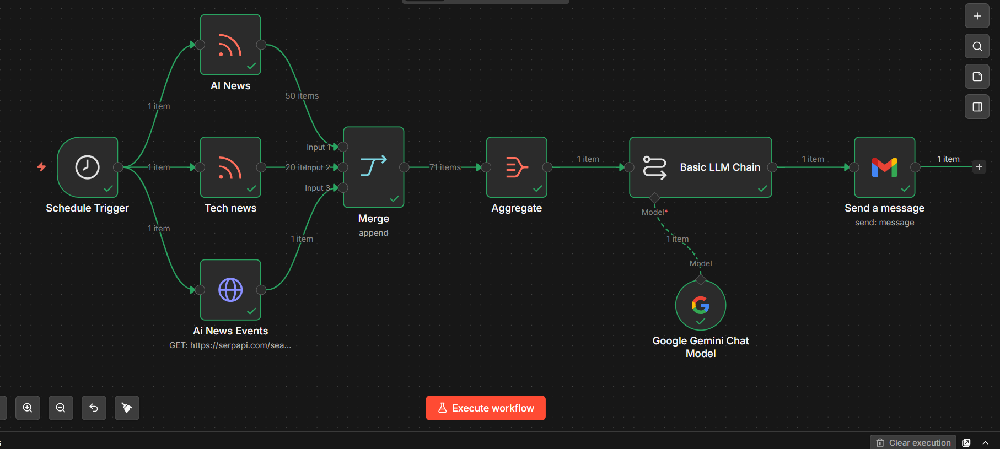

# 🤖 AI News Summarizer

An automated AI-powered news intelligence workflow built with **n8n** and **Google Gemini**.

The workflow collects AI news, technology updates, and upcoming AI events from multiple sources, processes the information using an LLM, and automatically delivers a concise daily technology briefing through Gmail.

## 🚀 Features

- 📰 Collects AI news through RSS feeds
- 💻 Collects technology news from TechCrunch
- 📅 Fetches upcoming AI and technology events
- 🔀 Combines news from multiple sources using n8n Merge
- 🤖 Uses Google Gemini to generate concise summaries
- 📧 Automatically sends the final daily briefing through Gmail
- ⏰ Runs automatically using an n8n Schedule Trigger

## 🔄 Workflow



Schedule Trigger
        ↓
 ┌──────┼──────────┐
 ↓      ↓          ↓
AI News Tech News  AI Events
 ↓      ↓          ↓
 └──────┼──────────┘
        ↓
      Merge
        ↓
    Aggregate
        ↓
 Google Gemini
        ↓
   Gmail Delivery

## 🛠️ Technologies Used

- n8n
- Google Gemini
- RSS Feeds
- TechCrunch
- SerpAPI
- Gmail
- AI / LLM workflow automation

## 📌 Data Sources

- AI Business RSS Feed
- TechCrunch RSS Feed
- Google Events through SerpAPI

## 🧠 AI Processing

Google Gemini processes the collected information and generates a structured technology briefing containing:

- AI News Highlights
- Technology Updates
- Upcoming AI Events

The workflow instructs the model to use only the provided items and generate concise, professional summaries.

## ⚙️ How It Works

1. The workflow starts automatically using a scheduled trigger.
2. AI-related news is collected from an RSS feed.
3. Technology news is collected from TechCrunch.
4. Upcoming AI events are retrieved through SerpAPI.
5. The collected data is merged and aggregated.
6. Google Gemini analyzes and summarizes the information.
7. The generated briefing is automatically sent through Gmail.

## 🔐 Security

API keys and private credentials have been removed from the GitHub version of the workflow.

Before running the workflow, configure your own:

- Google Gemini credentials
- SerpAPI credentials
- Gmail credentials

**Never commit API keys, passwords, tokens, or private credentials to GitHub.**

## 📂 Project Structure

```text
ai-news-summarizer/
│
├── ai-news-summarizer-github-safe.json
└── README.md
